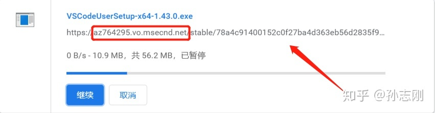

# vscode 下载更新
首先在官网找到需要下载的文件，点击下载。
在浏览器或者下载软件中就可以看到这么一个下载地址了，将其复制下来（如下图箭头所指）。

更新后的地址为：http://vscode.cdn.azure.cn/stable/78a4c91400152c0f27ba4d363eb56d2835f9903a/VSCodeUserSetup-x64-1.43.0.exe
这个就是国内的镜像了点开后你会发现速度直接起飞。
